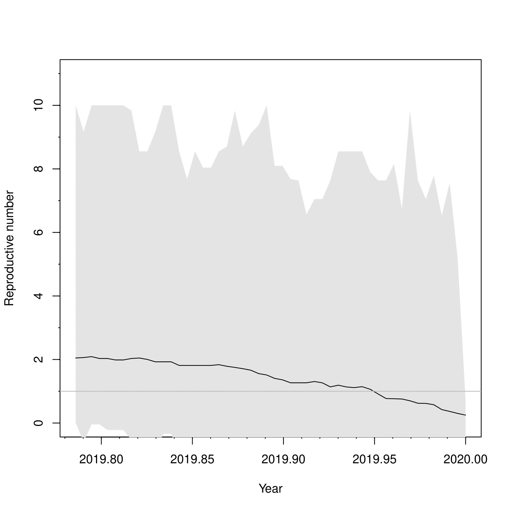

## Работа выполнена студентами: 
- Забелкин Алексей
- Яковлева Юлия

### 1) Скачать из соответствующего репозитория последовательности. 

Были скачаны геносмы из базы `NCBI Virus`, были выбраны геномы с полной последовательностью (Nucleotide Completeness = complete) и в качестве хоста выбран человек (Host=Homo sapiens).
Всего 1111 последовательностей, дата скачивания `Fri Apr 24 00:12:37 MSK 2020`, файл `source-sequences.fasta`.

### 2) Произвести множественное выравнивание

Command:  
`mafft --thread 32 --auto source-sequences.fasta > aligned-sequences.fasta`

### 3) Предобработать выравнивание

Предобработка выравнивания была осуществена с использованием Gblocks, результаты сохранены в файл `trimmed_aligned-sequences.fst`.
Из $29983$ исходных позиций в выравнивании осталось $29088$.

### 4) Проанализировать нейтральность эволюции последовательности в целом или произвести сканирование скользящим окном

#### Tajima's test
D-статистика Таджимы была посчитана с использвование программного продукта MegaX, результаты сохранены в файл `mega_tajima_results.txt`.
Результаты теста показывают отклонение гипотезы о нейтральности эволюции.

### 5) Для вирусных данных логичнее использовать гетерохронную Birth Death Skyline (BDSKY) модель, применение которой описано в том же туториале.

Для анализа популяционных характеристик был использован Beast с моделью Birth Death Skyline. Результаты приведены в папке `data/dbsky`, пример графика для репродуктивного числа представлен ниже.

### 6) dN/dS анализ

Для анализа был выбран ген поверхностного гликопротеина. Нуклеотидные последователности белков  (`data/dNdS/surface_glycoproteins.fa`) были получены из GenBank аннотации с помощью пользовательского скрипта (`data/dNdS/get_covid_data.py`) и выровнены с помощью MAFFT (`data/dNdS/surface_glycoprotein_aln.fa`). Z-тест был выполнен в программе MEGAX на выборке из 50 последовательностей (метод Nei-Gojobori Jukes-Cantor, bootstrap 1000). В результате было получено значение -0.57, которое может свидетельствовать о наличии отрицательного отбора. Для уточнения результатов необходимо провести анализ на большей выборке.

