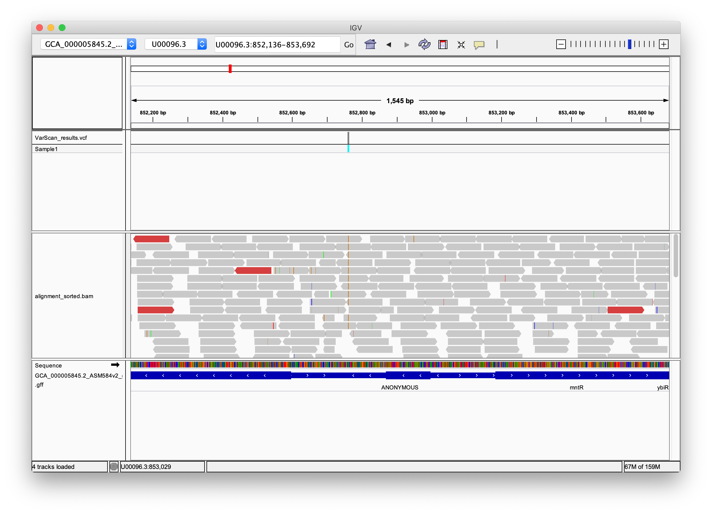

## 1. Data Mining

### Reference: Try 1

Trying to download reference sequence from ncbi:

Time:  
`Mon Nov 11 14:27:25 MSK 2019`

Command:  
`wget ftp://ftp.ncbi.nlm.nih.gov/genomes/genbank/bacteria/Escherichia_coli/all_assembly_versions/GCA_000005845.2_ASM584v2/`

Output:
```sh
--2019-11-11 14:31:26--  ftp://ftp.ncbi.nlm.nih.gov/genomes/genbank/bacteria/Escherichia_coli/all_assembly_versions/GCA_000005845.2_ASM584v2/*_genomic.fna.gz
           => ‘.listing’
Resolving ftp.ncbi.nlm.nih.gov (ftp.ncbi.nlm.nih.gov)... 130.14.250.12
Connecting to ftp.ncbi.nlm.nih.gov (ftp.ncbi.nlm.nih.gov)|130.14.250.12|:21... connected.
Logging in as anonymous ... Logged in!
==> SYST ... done.    ==> PWD ... done.
==> TYPE I ... done.  ==> CWD (1) /genomes/genbank/bacteria/Escherichia_coli/all_assembly_versions/GCA_000005845.2_ASM584v2 ...
Error in server response, closing control connection.
Retrying.

--2019-11-11 14:32:37--  ftp://ftp.ncbi.nlm.nih.gov/genomes/genbank/bacteria/Escherichia_coli/all_assembly_versions/GCA_000005845.2_ASM584v2/*_genomic.fna.gz
  (try: 2) => ‘.listing’
Connecting to ftp.ncbi.nlm.nih.gov (ftp.ncbi.nlm.nih.gov)|130.14.250.12|:21... connected.
Logging in as anonymous ... Logged in!
==> SYST ... done.    ==> PWD ... done.
==> TYPE I ... done.  ==> CWD (1) /genomes/genbank/bacteria/Escherichia_coli/all_assembly_versions/GCA_000005845.2_ASM584v2 ...
No such directory ‘genomes/genbank/bacteria/Escherichia_coli/all_assembly_versions/GCA_000005845.2_ASM584v2’.
```

The link seems to be broken :(

The new link is found at [NCBI](http://www.ncbi.nlm.nih.gov/genome/167) website:
ftp://ftp.ncbi.nlm.nih.gov/genomes/all/GCA/000/005/845/GCA_000005845.2_ASM584v2/

### Reference: Try 2

Time:  
`Mon Nov 11 14:54:08 MSK 2019`

Command:  
`wget ftp://ftp.ncbi.nlm.nih.gov/genomes/all/GCA/000/005/845/GCA_000005845.2_ASM584v2/GCA_000005845.2_ASM584v2_genomic.fna.gz`

Output:
```
--2019-11-11 14:56:55--  ftp://ftp.ncbi.nlm.nih.gov/genomes/all/GCA/000/005/845/GCA_000005845.2_ASM584v2/GCA_000005845.2_ASM584v2_genomic.fna.gz
           => ‘GCA_000005845.2_ASM584v2_genomic.fna.gz’
Resolving ftp.ncbi.nlm.nih.gov (ftp.ncbi.nlm.nih.gov)... 130.14.250.11
Connecting to ftp.ncbi.nlm.nih.gov (ftp.ncbi.nlm.nih.gov)|130.14.250.11|:21... connected.
Logging in as anonymous ... Logged in!
==> SYST ... done.    ==> PWD ... done.
==> TYPE I ... done.  ==> CWD (1) /genomes/all/GCA/000/005/845/GCA_000005845.2_ASM584v2 ... done.
==> SIZE GCA_000005845.2_ASM584v2_genomic.fna.gz ... 1379898
==> PASV ... done.    ==> RETR GCA_000005845.2_ASM584v2_genomic.fna.gz ... done.
Length: 1379898 (1.3M) (unauthoritative)

GCA_000005845.2_ASM584v2_genomic.fna.gz          100%[=======================================================================================================>]   1.32M   297KB/s    in 4.5s

2019-11-11 14:57:04 (297 KB/s) - ‘GCA_000005845.2_ASM584v2_genomic.fna.gz’ saved [1379898]
```

Command:  
`wget ftp://ftp.ncbi.nlm.nih.gov/genomes/all/GCA/000/005/845/GCA_000005845.2_ASM584v2/GCA_000005845.2_ASM584v2_genomic.gff.gz`

Output:
```
--2019-11-11 14:57:59--  ftp://ftp.ncbi.nlm.nih.gov/genomes/all/GCA/000/005/845/GCA_000005845.2_ASM584v2/GCA_000005845.2_ASM584v2_genomic.gff.gz
           => ‘GCA_000005845.2_ASM584v2_genomic.gff.gz’
Resolving ftp.ncbi.nlm.nih.gov (ftp.ncbi.nlm.nih.gov)... 130.14.250.13
Connecting to ftp.ncbi.nlm.nih.gov (ftp.ncbi.nlm.nih.gov)|130.14.250.13|:21... connected.
Logging in as anonymous ... Logged in!
==> SYST ... done.    ==> PWD ... done.
==> TYPE I ... done.  ==> CWD (1) /genomes/all/GCA/000/005/845/GCA_000005845.2_ASM584v2 ... done.
==> SIZE GCA_000005845.2_ASM584v2_genomic.gff.gz ... 443226
==> PASV ... done.    ==> RETR GCA_000005845.2_ASM584v2_genomic.gff.gz ... done.
Length: 443226 (433K) (unauthoritative)

GCA_000005845.2_ASM584v2_genomic.gff.gz          100%[=======================================================================================================>] 432.84K  69.0KB/s    in 6.7s

2019-11-11 14:58:10 (65.0 KB/s) - ‘GCA_000005845.2_ASM584v2_genomic.gff.gz’ saved [443226]
```

### Illumina Reads

Time:  
`Mon Nov 11 15:01:12 MSK 2019`

Command:  
`wget http://public.dobzhanskycenter.ru/mrayko/amp_res_1.fastq.zip & wget http://public.dobzhanskycenter.ru/mrayko/amp_res_2.fastq.zip`

```sh
--2019-11-11 15:02:11--  http://public.dobzhanskycenter.ru/mrayko/amp_res_2.fastq.zip

Redirecting output to ‘wget-log’.
Resolving public.dobzhanskycenter.ru (public.dobzhanskycenter.ru)... 195.70.204.3
Connecting to public.dobzhanskycenter.ru (public.dobzhanskycenter.ru)|195.70.204.3|:80... connected.
HTTP request sent, awaiting response... 200 OK
Length: 41768152 (40M) [application/zip]
Saving to: ‘amp_res_2.fastq.zip’

amp_res_2.fastq.zip                              100%[=======================================================================================================>]  39.83M   711KB/s    in 69s

2019-11-11 15:03:21 (587 KB/s) - ‘amp_res_2.fastq.zip’ saved [41768152/41768152]

[1]+  Done                    wget http://public.dobzhanskycenter.ru/mrayko/amp_res_1.fastq.zip
```

### Unarchiving

Time:  
`Mon Nov 11 15:13:46 MSK 2019`

Command:  
`gunzip GCA_000005845.2_ASM584v2_genomic.fna.gz & gunzip GCA_000005845.2_ASM584v2_genomic.gff.gz`

Output:
```sh
[1] 3634
[1]+  Done                    gunzip GCA_000005845.2_ASM584v2_genomic.fna.gz
```

Command:  
`unzip amp_res_1.fastq.zip & unzip amp_res_2.fastq.zip & rm *.zip`

Output:
```sh
[1] 3696
Archive:  amp_res_1.fastq.zip
Archive:  amp_res_2.fastq.zip
  inflating: amp_res_2.fastq           inflating: amp_res_1.fastq

[1]+  Done                    unzip amp_res_1.fastq.zip
```

## 2. Inspect Raw Sequencing Data Manually

### Checking Raw Data

Time:  
`Mon Nov 11 15:21:56 MSK 2019`

Command:  
`head -20 amp_res_1.fastq`

Output:
```
@SRR1363257.37 GWZHISEQ01:153:C1W31ACXX:5:1101:14027:2198 length=101
GGTTGCAGATTCGCAGTGTCGCTGTTCCAGCGCATCACATCTTTGATGTTCACGCCGTGGCGTTTAGCAATGCTTGAAAGCGAATCGCCTTTGCCCACACG
+
@?:=:;DBFADH;CAECEE@@E:FFHGAE4?C?DE<BFGEC>?>FHE4BFFIIFHIBABEECA83;>>@>@CCCDC9@@CC08<@?@BB@9:CC#######
@SRR1363257.46 GWZHISEQ01:153:C1W31ACXX:5:1101:19721:2155 length=101
GTATGAGGTTTTGCTGCATTCTCTGNGCGAATATTAACTCCNTNNNNNTTATAGTTCAAAGCAAGTACCTGTCTCTTATACACATCTCCGAGCCCACGAGC
+
@@<?=D?D==?<AFGDF+AIHEACH#22<:?E8??:9??GG#0#####000;CF=C)4.==CA@@@)=7?C7?E37;3@>;;(.;>AB#############
@SRR1363257.77 GWZHISEQ01:153:C1W31ACXX:5:1101:5069:2307 length=101
GCTTCTCTTAACTGAGGTCACCATCATGCCGTTAAGTCCCTACCTCTCTTTTGCCGGTAACTGTTCCGCCGCGATTGCCTTTTATCTGTCTCTTATACACC
+
??<DBD;4C2=<BB>:AC;<CF<CE@FE9@E1C@891CD*9:?:3D@DD4?D<DD:0;@A=AEIDDA##################################
@SRR1363257.78 GWZHISEQ01:153:C1W31ACXX:5:1101:5178:2440 length=101
GCATAAGGACGATCGCTCCAGAGTAAAATAAATACGCGCATGTGATACTCACAATACCAATGGTGAAGTTACGGGACTTAAACAAACTGAGATCAAGAATC
+
CCCFFFFFHHHHHJJJJJJJJJJFFHIJJJJJJJJJJJJJJJJJJJJJJJIJHHHHHHFDEDF;AEEEEEEDDDDDBBACDDDCDDDDCCDDDDDDCCDC3
@SRR1363257.96 GWZHISEQ01:153:C1W31ACXX:5:1101:6707:2460 length=101
TCATTAAGCCGTGGTGGATGTGCCATAGCGCACCGCAAAGTTAAGAAACCGAATATTGGGTTTAGTCTTGTTTCATAATTGTTGCAATGAAACGCGGTGAA
+
CCCFFFFFHHHHHJHIIJIIIIJJJJJJGIJJJJJIJJIIGHJJJJJIIJJDHFFFFFEDACDDDCDDDDCCDDECACCDCCCDACDDDDCCDDDDDBD@A
```

Command:  
`head -20 amp_res_2.fastq`

Output:
```
@SRR1363257.37 GWZHISEQ01:153:C1W31ACXX:5:1101:14027:2198 length=101
GATCTAAGCTGAAGCCAGGCCAAAGTTTGACGATTGGTGCAGGCAGTAGCGCACAGCGACTGGCAAACAACAGCGATAGCATTACGTATCGTGTGCGCAAA
+
???BDB:DFHBFD@9;;+A;AFGH;ABHFHHGE@9:B:??@D>@;F?D8<<F8AA9EHHD8'..;5?A?A992(',(59CC3@C>22::A238+2>B<>B<
@SRR1363257.46 GWZHISEQ01:153:C1W31ACXX:5:1101:19721:2155 length=101
GTACTTGCTTTGNACTATAATATGCACGGAGNTAATATTCGCTCAGAGAATGCAGCAAAACCTCATACCTGTCTCTTATACACATCTGACGCTGCCGACGA
+
;@@DB?B;CFBB#2<:CB:FH<C@:<A?C::#1:86:BG9:8?8688?888EBF;783)=6-7=CC;ECD);?7;;>>AE;>(5;->AC@;B@;8?#####
@SRR1363257.77 GWZHISEQ01:153:C1W31ACXX:5:1101:5069:2307 length=101
ATAATAGGCAATCGCGTCGGAACAGTTACCGGCCAAAGAGAGGCAGGGACTTAACGGCATGATGGTGACCTCAGTTAAGAGAAGCCTGTCTCTTATACACA
+
+=?;:2,+A++AC:C:2@F6:CD:B09B?4)8@''8=))8=;=((5=4@?;@6;@?@BB;(535::>:>3(::(44:@::@3((9<32+::@(4@4+:>C3
@SRR1363257.78 GWZHISEQ01:153:C1W31ACXX:5:1101:5178:2440 length=101
ATATTAACAGTAGTATCAGTTATTTCTCTGATCTCTTTAGTCATTTGGGAGTCGACCTCAGAGAACCCGATTCTTGATCTCAGTTTGTTTAAGTCCCGTAA
+
BCCFFFFFHHHHHHIJJIJJJJJIJJJJIJGIJJJJJJIJHIHJJIJIIGGGHIJIJJJIJIJJJJJJJGHHHHHFFFFFFEEEFEEED?AACCDCCDDDB
@SRR1363257.96 GWZHISEQ01:153:C1W31ACXX:5:1101:6707:2460 length=101
GTTTCACCGCGTTTCATTGCAACAATTATGAAACAAGACTAAACCCAATATTCGGTTTCTTAACTTTGCGGTGCGCTATGGCACATCCACCACGGCTTAAT
+
CCCFFFFFHGHHHJIJJJJJJIJJJJJJIJIJJIJJIJIJJJJJJJJIJJFHIIJFIGJJJGIHHHHHGFFDDDDDDDDDDDDDDDDDDDABDDDDDDDCD
```

Command:  
`head -20 GCA_000005845.2_ASM584v2_genomic.fna`

Output:
```
>U00096.3 Escherichia coli str. K-12 substr. MG1655, complete genome
AGCTTTTCATTCTGACTGCAACGGGCAATATGTCTCTGTGTGGATTAAAAAAAGAGTGTCTGATAGCAGCTTCTGAACTG
GTTACCTGCCGTGAGTAAATTAAAATTTTATTGACTTAGGTCACTAAATACTTTAACCAATATAGGCATAGCGCACAGAC
AGATAAAAATTACAGAGTACACAACATCCATGAAACGCATTAGCACCACCATTACCACCACCATCACCATTACCACAGGT
AACGGTGCGGGCTGACGCGTACAGGAAACACAGAAAAAAGCCCGCACCTGACAGTGCGGGCTTTTTTTTTCGACCAAAGG
TAACGAGGTAACAACCATGCGAGTGTTGAAGTTCGGCGGTACATCAGTGGCAAATGCAGAACGTTTTCTGCGTGTTGCCG
ATATTCTGGAAAGCAATGCCAGGCAGGGGCAGGTGGCCACCGTCCTCTCTGCCCCCGCCAAAATCACCAACCACCTGGTG
GCGATGATTGAAAAAACCATTAGCGGCCAGGATGCTTTACCCAATATCAGCGATGCCGAACGTATTTTTGCCGAACTTTT
GACGGGACTCGCCGCCGCCCAGCCGGGGTTCCCGCTGGCGCAATTGAAAACTTTCGTCGATCAGGAATTTGCCCAAATAA
AACATGTCCTGCATGGCATTAGTTTGTTGGGGCAGTGCCCGGATAGCATCAACGCTGCGCTGATTTGCCGTGGCGAGAAA
ATGTCGATCGCCATTATGGCCGGCGTATTAGAAGCGCGCGGTCACAACGTTACTGTTATCGATCCGGTCGAAAAACTGCT
GGCAGTGGGGCATTACCTCGAATCTACCGTCGATATTGCTGAGTCCACCCGCCGTATTGCGGCAAGCCGCATTCCGGCTG
ATCACATGGTGCTGATGGCAGGTTTCACCGCCGGTAATGAAAAAGGCGAACTGGTGGTGCTTGGACGCAACGGTTCCGAC
TACTCTGCTGCGGTGCTGGCTGCCTGTTTACGCGCCGATTGTTGCGAGATTTGGACGGACGTTGACGGGGTCTATACCTG
CGACCCGCGTCAGGTGCCCGATGCGAGGTTGTTGAAGTCGATGTCCTACCAGGAAGCGATGGAGCTTTCCTACTTCGGCG
CTAAAGTTCTTCACCCCCGCACCATTACCCCCATCGCCCAGTTCCAGATCCCTTGCCTGATTAAAAATACCGGAAATCCT
CAAGCACCAGGTACGCTCATTGGTGCCAGCCGTGATGAAGACGAATTACCGGTCAAGGGCATTTCCAATCTGAATAACAT
GGCAATGTTCAGCGTTTCTGGTCCGGGGATGAAAGGGATGGTCGGCATGGCGGCGCGCGTCTTTGCAGCGATGTCACGCG
CCCGTATTTCCGTGGTGCTGATTACGCAATCATCTTCCGAATACAGCATCAGTTTCTGCGTTCCACAAAGCGACTGTGTG
CGAGCTGAACGGGCAATGCAGGAAGAGTTCTACCTGGAACTGAAAGAAGGCTTACTGGAGCCGCTGGCAGTGACGGAACG
```

Command:  
`head -20 GCA_000005845.2_ASM584v2_genomic.gff`

Output:
```
##gff-version 3
#!gff-spec-version 1.21
#!processor NCBI annotwriter
#!genome-build ASM584v2
#!genome-build-accession NCBI_Assembly:GCA_000005845.2
##sequence-region U00096.3 1 4641652
##species https://www.ncbi.nlm.nih.gov/Taxonomy/Browser/wwwtax.cgi?id=511145
U00096.3	Genbank	region	1	4641652	.	+	.	ID=U00096.3:1..4641652;Dbxref=taxon:511145;Is_circular=true;Name=ANONYMOUS;gbkey=Src;genome=chromosome;mol_type=genomic DNA;strain=K-12;substrain=MG1655
U00096.3	Genbank	gene	190	255	.	+	.	ID=gene-b0001;Dbxref=ASAP:ABE-0000006,ECOCYC:EG11277,EcoGene:EG11277;Name=thrL;gbkey=Gene;gene=thrL;gene_biotype=protein_coding;gene_synonym=ECK0001;locus_tag=b0001
U00096.3	Genbank	CDS	190	255	.	+	0	ID=cds-AAC73112.1;Parent=gene-b0001;Dbxref=UniProtKB/Swiss-Prot:P0AD86,NCBI_GP:AAC73112.1,ASAP:ABE-0000006,ECOCYC:EG11277,EcoGene:EG11277;Name=AAC73112.1;gbkey=CDS;gene=thrL;locus_tag=b0001;orig_transcript_id=gnl|b0001|mrna.b0001;product=thr operon leader peptide;protein_id=AAC73112.1;transl_table=11
U00096.3	Genbank	gene	337	2799	.	+	.	ID=gene-b0002;Dbxref=ASAP:ABE-0000008,ECOCYC:EG10998,EcoGene:EG10998;Name=thrA;gbkey=Gene;gene=thrA;gene_biotype=protein_coding;gene_synonym=ECK0002,Hs,thrA1,thrA2,thrD;locus_tag=b0002
U00096.3	Genbank	CDS	337	2799	.	+	0	ID=cds-AAC73113.1;Parent=gene-b0002;Dbxref=UniProtKB/Swiss-Prot:P00561,NCBI_GP:AAC73113.1,ASAP:ABE-0000008,ECOCYC:EG10998,EcoGene:EG10998;Name=AAC73113.1;gbkey=CDS;gene=thrA;locus_tag=b0002;orig_transcript_id=gnl|b0002|mrna.b0002;product=fused aspartate kinase/homoserine dehydrogenase 1;protein_id=AAC73113.1;transl_table=11
U00096.3	Genbank	gene	2801	3733	.	+	.	ID=gene-b0003;Dbxref=ASAP:ABE-0000010,ECOCYC:EG10999,EcoGene:EG10999;Name=thrB;gbkey=Gene;gene=thrB;gene_biotype=protein_coding;gene_synonym=ECK0003;locus_tag=b0003
U00096.3	Genbank	CDS	2801	3733	.	+	0	ID=cds-AAC73114.1;Parent=gene-b0003;Dbxref=UniProtKB/Swiss-Prot:P00547,NCBI_GP:AAC73114.1,ASAP:ABE-0000010,ECOCYC:EG10999,EcoGene:EG10999;Name=AAC73114.1;gbkey=CDS;gene=thrB;locus_tag=b0003;orig_transcript_id=gnl|b0003|mrna.b0003;product=homoserine kinase;protein_id=AAC73114.1;transl_table=11
U00096.3	Genbank	gene	3734	5020	.	+	.	ID=gene-b0004;Dbxref=ASAP:ABE-0000012,ECOCYC:EG11000,EcoGene:EG11000;Name=thrC;gbkey=Gene;gene=thrC;gene_biotype=protein_coding;gene_synonym=ECK0004;locus_tag=b0004
U00096.3	Genbank	CDS	3734	5020	.	+	0	ID=cds-AAC73115.1;Parent=gene-b0004;Dbxref=UniProtKB/Swiss-Prot:P00934,NCBI_GP:AAC73115.1,ASAP:ABE-0000012,ECOCYC:EG11000,EcoGene:EG11000;Name=AAC73115.1;gbkey=CDS;gene=thrC;locus_tag=b0004;orig_transcript_id=gnl|b0004|mrna.b0004;product=threonine synthase;protein_id=AAC73115.1;transl_table=11
U00096.3	Genbank	gene	5234	5530	.	+	.	ID=gene-b0005;Dbxref=ASAP:ABE-0000015,ECOCYC:G6081,EcoGene:EG14384;Name=yaaX;gbkey=Gene;gene=yaaX;gene_biotype=protein_coding;gene_synonym=ECK0005;locus_tag=b0005
U00096.3	Genbank	CDS	5234	5530	.	+	0	ID=cds-AAC73116.1;Parent=gene-b0005;Dbxref=UniProtKB/Swiss-Prot:P75616,NCBI_GP:AAC73116.1,ASAP:ABE-0000015,ECOCYC:G6081,EcoGene:EG14384;Name=AAC73116.1;gbkey=CDS;gene=yaaX;locus_tag=b0005;orig_transcript_id=gnl|b0005|mrna.b0005;product=DUF2502 domain-containing protein YaaX;protein_id=AAC73116.1;transl_table=11
U00096.3	Genbank	repeat_region	5566	5601	.	+	.	ID=id-12;Note=REP1a;gbkey=repeat_region;rpt_type=other
U00096.3	Genbank	repeat_region	5637	5670	.	-	.	ID=id-13;Note=REP1b;gbkey=repeat_region;rpt_type=other
```

### Counting reads in `fastq`

Time:  
`Mon Nov 11 15:31:48 MSK 2019`

Command:  
`wc -l amp_res_1.fastq`

Output:  
`1823504 amp_res_1.fastq`

Then we have *1823504 / 4 = 455876* reads.  
Same to `amp_res_2.fastq` becouse it's just reversed version.

## 3. Inspect raw sequencing data with fastqc. Filtering the reads

### Inslling fastq

Time:  
`Mon Nov 11 15:42:18 MSK 2019`

Command:
`brew install fastqc`

Output:
```
==> Downloading https://www.bioinformatics.babraham.ac.uk/projects/fastqc/fastqc_v0.11.8.zip
######################################################################## 100.0%
🍺  /usr/local/Cellar/fastqc/0.11.8: 257 files, 10.8MB, built in 19 seconds
```

#### Running fastqc

Time:  
`Mon Nov 11 15:46:35 MSK 2019`

Command:  
`fastqc -o . amp_res_1.fastq amp_res_2.fastq`

Output:
```
Started analysis of amp_res_1.fastq
Approx 5% complete for amp_res_1.fastq
Approx 10% complete for amp_res_1.fastq
Approx 15% complete for amp_res_1.fastq
Approx 20% complete for amp_res_1.fastq
Approx 25% complete for amp_res_1.fastq
Approx 30% complete for amp_res_1.fastq
Approx 35% complete for amp_res_1.fastq
Approx 40% complete for amp_res_1.fastq
Approx 45% complete for amp_res_1.fastq
Approx 50% complete for amp_res_1.fastq
Approx 55% complete for amp_res_1.fastq
Approx 60% complete for amp_res_1.fastq
Approx 65% complete for amp_res_1.fastq
Approx 70% complete for amp_res_1.fastq
Approx 75% complete for amp_res_1.fastq
Approx 80% complete for amp_res_1.fastq
Approx 85% complete for amp_res_1.fastq
Approx 90% complete for amp_res_1.fastq
Approx 95% complete for amp_res_1.fastq
Analysis complete for amp_res_1.fastq
Started analysis of amp_res_2.fastq
Approx 5% complete for amp_res_2.fastq
Approx 10% complete for amp_res_2.fastq
Approx 15% complete for amp_res_2.fastq
Approx 20% complete for amp_res_2.fastq
Approx 25% complete for amp_res_2.fastq
Approx 30% complete for amp_res_2.fastq
Approx 35% complete for amp_res_2.fastq
Approx 40% complete for amp_res_2.fastq
Approx 45% complete for amp_res_2.fastq
Approx 50% complete for amp_res_2.fastq
Approx 55% complete for amp_res_2.fastq
Approx 60% complete for amp_res_2.fastq
Approx 65% complete for amp_res_2.fastq
Approx 70% complete for amp_res_2.fastq
Approx 75% complete for amp_res_2.fastq
Approx 80% complete for amp_res_2.fastq
Approx 85% complete for amp_res_2.fastq
Approx 90% complete for amp_res_2.fastq
Approx 95% complete for amp_res_2.fastq
Analysis complete for amp_res_2.fastq
```

Chicking that this generated some files:
```
alexey@Alexeys-MacBook-Pro:~/PycharmProjects/miniprojects/project1/raw_data$ ls -l
total 265M
-rw-r--r-- 1 alexey 4.5M Nov 11 14:57 GCA_000005845.2_ASM584v2_genomic.fna
-rw-r--r-- 1 alexey 2.6M Nov 11 14:58 GCA_000005845.2_ASM584v2_genomic.gff
-rw-rw-r-- 1 alexey 122M Apr  4  2017 amp_res_1.fastq
-rw-r--r-- 1 alexey 258K Nov 11 15:45 amp_res_1_fastqc.html
-rw-r--r-- 1 alexey 343K Nov 11 15:45 amp_res_1_fastqc.zip
-rw-rw-r-- 1 alexey 122M Apr  4  2017 amp_res_2.fastq
-rw-r--r-- 1 alexey 257K Nov 11 15:45 amp_res_2_fastqc.html
-rw-r--r-- 1 alexey 343K Nov 11 15:45 amp_res_2_fastqc.zip
```

### Checking out html files

Let's take a loof to generated html file `amp_res_1_fastqc.html`:

> Filename:                            amp_res_1.fastq  
> File type:                           Conventional base calls  
> Encoding:                            Sanger / Illumina 1.9  
> Total Sequences:                     455876  
> Sequences flagged as poor quality:    0  
> Sequence length:                      101  
> %GC:                                  50  

There are *455876* total sequences, whitch is equal to our calculation before.

There are two red cycles:
#### Per Base Sequence Quality:


Meaning from documentation:  
> This module will raise a failure if the lower quartile for any base is less than 5 or if the median for any base is less than 20.

Reason:  
> The most common reason for warnings and failures in this module is a general degradation of quality over the duration of long runs. In general sequencing chemistry degrades with increasing read length and for long runs you may find that the general quality of the run falls to a level where a warning or error is triggered.

#### Per Tile Sequence Quality:


Meaning from documentation:  
> This module will issue a warning if any tile shows a mean Phred score more than 5 less than the mean for that base across all tiles.

Reason:
> Whilst warnings in this module can be triggered by individual specific events we have also observed that greater variation in the phred scores attributed to tiles can also appear when a flowcell is generally overloaded. In this case events appear all over the flowcell rather than being confined to a specific area or range of cycles. We would generally ignore errors which mildly affected a small number of tiles for only 1 or 2 cycles, but would pursue larger effects which showed high deviation in scores, or which persisted for several cycles.

**Looks like it would be great to filter the reads**

## 4. (Optional, 1 bonus point) Filtering the reads 

### Filtering

Running Trimmomatic with certain parameters.

> Encoding: Sanger / Illumina 1.9

Then pass `phred33` as phred scale.

> Cut bases off the start of a read if quality below 20

Then pass `LEADING:20`.

> Cut bases off the end of a read if quality below 20

Then pass `TRAILING:20`.

>Trim reads using a sliding window approach, with window size 10 and average quality  within the window 20.

Then pass `SLIDINGWINDOW:10:20`.

> Drop the read if it is below length 20.

Then pass `MINLEN:20`.

If we look at *Adapter Content* in *html* file we will see one problem adapter: **Nextera Transposase Sequence**.  
Then pass `ILLUMINACLIP:NexteraPE-PE.fa:2:30:10`.

Time:  
`Mon Nov 11 17:45:51 MSK 2019`

Command:  
`Trimmomatic PE -phred33 amp_res_1.fastq amp_res_2.fastq output_forward_paired.fastq output_forward_unpaired.fastq output_reverse_paired.fastq output_reverse_unpaired.fastq ILLUMINACLIP:NexteraPE-PE.fa:2:30:10 LEADING:20 TRAILING:20 SLIDINGWINDOW:10:20 MINLEN:20`

Output:
```
TrimmomaticPE: Started with arguments:
 -phred33 amp_res_1.fastq amp_res_2.fastq output_forward_paired.fastq output_forward_unpaired.fastq output_reverse_paired.fastq output_reverse_unpaired.fastq ILLUMINACLIP:NexteraPE-PE.fa:2:30:10 LEADING:20 TRAILING:20 SLIDINGWINDOW:10:20 MINLEN:20
Multiple cores found: Using 4 threads
Using PrefixPair: 'AGATGTGTATAAGAGACAG' and 'AGATGTGTATAAGAGACAG'
Using Long Clipping Sequence: 'GTCTCGTGGGCTCGGAGATGTGTATAAGAGACAG'
Using Long Clipping Sequence: 'TCGTCGGCAGCGTCAGATGTGTATAAGAGACAG'
Using Long Clipping Sequence: 'CTGTCTCTTATACACATCTCCGAGCCCACGAGAC'
Using Long Clipping Sequence: 'CTGTCTCTTATACACATCTGACGCTGCCGACGA'
ILLUMINACLIP: Using 1 prefix pairs, 4 forward/reverse sequences, 0 forward only sequences, 0 reverse only sequences
Input Read Pairs: 455876 Both Surviving: 423666 (92.93%) Forward Only Surviving: 31801 (6.98%) Reverse Only Surviving: 265 (0.06%) Dropped: 144 (0.03%)
TrimmomaticPE: Completed successfully
```

### Checking reads

Let's check with **fastQC**!

Time:  
`Mon Nov 11 17:47:49 MSK 2019`

Command:  
`fastqc -o . output_forward_paired.fastq output_reverse_paired.fastq`

Output:
```
Started analysis of output_forward_paired.fastq
Approx 5% complete for output_forward_paired.fastq
Approx 10% complete for output_forward_paired.fastq
Approx 15% complete for output_forward_paired.fastq
Approx 20% complete for output_forward_paired.fastq
Approx 25% complete for output_forward_paired.fastq
Approx 30% complete for output_forward_paired.fastq
Approx 35% complete for output_forward_paired.fastq
Approx 40% complete for output_forward_paired.fastq
Approx 45% complete for output_forward_paired.fastq
Approx 50% complete for output_forward_paired.fastq
Approx 55% complete for output_forward_paired.fastq
Approx 60% complete for output_forward_paired.fastq
Approx 65% complete for output_forward_paired.fastq
Approx 70% complete for output_forward_paired.fastq
Approx 75% complete for output_forward_paired.fastq
Approx 80% complete for output_forward_paired.fastq
Approx 85% complete for output_forward_paired.fastq
Approx 90% complete for output_forward_paired.fastq
Approx 95% complete for output_forward_paired.fastq
Analysis complete for output_forward_paired.fastq
Started analysis of output_reverse_paired.fastq
Approx 5% complete for output_reverse_paired.fastq
Approx 10% complete for output_reverse_paired.fastq
Approx 15% complete for output_reverse_paired.fastq
Approx 20% complete for output_reverse_paired.fastq
Approx 25% complete for output_reverse_paired.fastq
Approx 30% complete for output_reverse_paired.fastq
Approx 35% complete for output_reverse_paired.fastq
Approx 40% complete for output_reverse_paired.fastq
Approx 45% complete for output_reverse_paired.fastq
Approx 50% complete for output_reverse_paired.fastq
Approx 55% complete for output_reverse_paired.fastq
Approx 60% complete for output_reverse_paired.fastq
Approx 65% complete for output_reverse_paired.fastq
Approx 70% complete for output_reverse_paired.fastq
Approx 75% complete for output_reverse_paired.fastq
Approx 80% complete for output_reverse_paired.fastq
Approx 85% complete for output_reverse_paired.fastq
Approx 90% complete for output_reverse_paired.fastq
Approx 95% complete for output_reverse_paired.fastq
Analysis complete for output_reverse_paired.fastq
```

Total Sequences are equal to *423666* in both *html* files.
Most of red cycles are gone, but one left for **Per tile sequence quality** in `output_forward_paired.fastq`.

### Playing with quality score equal to 30

Time:  
`Mon Nov 11 17:54:47 MSK 2019`

Command:  
`Trimmomatic PE -phred33 amp_res_1.fastq amp_res_2.fastq output_forward_paired_temp.fastq output_forward_unpaired_temp.fastq output_reverse_paired_temp.fastq output_reverse_unpaired_temp.fastq ILLUMINACLIP:NexteraPE-PE.fa:2:30:10 LEADING:30 TRAILING:30 SLIDINGWINDOW:10:30 MINLEN:20`

Output:
```
TrimmomaticPE: Started with arguments:
 -phred33 amp_res_1.fastq amp_res_2.fastq output_forward_paired_temp.fastq output_forward_unpaired_temp.fastq output_reverse_paired_temp.fastq output_reverse_unpaired_temp.fastq ILLUMINACLIP:NexteraPE-PE.fa:2:30:10 LEADING:30 TRAILING:30 SLIDINGWINDOW:10:30 MINLEN:20
Multiple cores found: Using 4 threads
Using PrefixPair: 'AGATGTGTATAAGAGACAG' and 'AGATGTGTATAAGAGACAG'
Using Long Clipping Sequence: 'GTCTCGTGGGCTCGGAGATGTGTATAAGAGACAG'
Using Long Clipping Sequence: 'TCGTCGGCAGCGTCAGATGTGTATAAGAGACAG'
Using Long Clipping Sequence: 'CTGTCTCTTATACACATCTCCGAGCCCACGAGAC'
Using Long Clipping Sequence: 'CTGTCTCTTATACACATCTGACGCTGCCGACGA'
ILLUMINACLIP: Using 1 prefix pairs, 4 forward/reverse sequences, 0 forward only sequences, 0 reverse only sequences
Input Read Pairs: 455876 Both Surviving: 357386 (78.40%) Forward Only Surviving: 52783 (11.58%) Reverse Only Surviving: 23762 (5.21%) Dropped: 21945 (4.81%)
TrimmomaticPE: Completed successfully
```

As we can see, we lost another *15 %* more of data. But it has better quality!

Remove result with command: `rm *temp.fastq`

## 5. Align your reads

### Indexing the reference file 

Time:  
`Mon Nov 11 20:51:59 MSK 2019`

Command:  
`bwa index GCA_000005845.2_ASM584v2_genomic.fna`

Output:
```
[bwa_index] Pack FASTA... 0.07 sec
[bwa_index] Construct BWT for the packed sequence...
[bwa_index] 2.19 seconds elapse.
[bwa_index] Update BWT... 0.06 sec
[bwa_index] Pack forward-only FASTA... 0.04 sec
[bwa_index] Construct SA from BWT and Occ... 0.72 sec
[main] Version: 0.7.17-r1188
[main] CMD: bwa index GCA_000005845.2_ASM584v2_genomic.fna
[main] Real time: 3.582 sec; CPU: 3.078 sec
```

### Aligning reads

Time:  
`Mon Nov 11 20:55:06 MSK 2019`

Command:  
`bwa mem GCA_000005845.2_ASM584v2_genomic.fna output_forward_paired.fastq output_reverse_paired.fastq > alignment.sam`

Output:
```
[M::bwa_idx_load_from_disk] read 0 ALT contigs
[M::process] read 106528 sequences (10000050 bp)...
[M::process] read 108312 sequences (10000169 bp)...
[M::mem_pestat] # candidate unique pairs for (FF, FR, RF, RR): (12, 51303, 0, 21)
[M::mem_pestat] analyzing insert size distribution for orientation FF...
[M::mem_pestat] (25, 50, 75) percentile: (105, 136, 310)
[M::mem_pestat] low and high boundaries for computing mean and std.dev: (1, 720)
[M::mem_pestat] mean and std.dev: (155.82, 93.92)
[M::mem_pestat] low and high boundaries for proper pairs: (1, 925)
[M::mem_pestat] analyzing insert size distribution for orientation FR...
[M::mem_pestat] (25, 50, 75) percentile: (151, 188, 233)
[M::mem_pestat] low and high boundaries for computing mean and std.dev: (1, 397)
[M::mem_pestat] mean and std.dev: (195.12, 58.87)
[M::mem_pestat] low and high boundaries for proper pairs: (1, 479)
[M::mem_pestat] skip orientation RF as there are not enough pairs
[M::mem_pestat] analyzing insert size distribution for orientation RR...
[M::mem_pestat] (25, 50, 75) percentile: (117, 158, 1540)
[M::mem_pestat] low and high boundaries for computing mean and std.dev: (1, 4386)
[M::mem_pestat] mean and std.dev: (523.90, 696.25)
[M::mem_pestat] low and high boundaries for proper pairs: (1, 5809)
[M::mem_pestat] skip orientation FF
[M::mem_pestat] skip orientation RR
[M::mem_process_seqs] Processed 106528 reads in 5.028 CPU sec, 5.469 real sec
[M::process] read 110458 sequences (10000145 bp)...
[M::mem_pestat] # candidate unique pairs for (FF, FR, RF, RR): (17, 51988, 0, 17)
[M::mem_pestat] analyzing insert size distribution for orientation FF...
[M::mem_pestat] (25, 50, 75) percentile: (71, 101, 229)
[M::mem_pestat] low and high boundaries for computing mean and std.dev: (1, 545)
[M::mem_pestat] mean and std.dev: (114.67, 72.16)
[M::mem_pestat] low and high boundaries for proper pairs: (1, 703)
[M::mem_pestat] analyzing insert size distribution for orientation FR...
[M::mem_pestat] (25, 50, 75) percentile: (150, 187, 231)
[M::mem_pestat] low and high boundaries for computing mean and std.dev: (1, 393)
[M::mem_pestat] mean and std.dev: (193.30, 58.34)
[M::mem_pestat] low and high boundaries for proper pairs: (1, 474)
[M::mem_pestat] skip orientation RF as there are not enough pairs
[M::mem_pestat] analyzing insert size distribution for orientation RR...
[M::mem_pestat] (25, 50, 75) percentile: (89, 176, 483)
[M::mem_pestat] low and high boundaries for computing mean and std.dev: (1, 1271)
[M::mem_pestat] mean and std.dev: (169.14, 114.54)
[M::mem_pestat] low and high boundaries for proper pairs: (1, 1665)
[M::mem_pestat] skip orientation FF
[M::mem_pestat] skip orientation RR
[M::mem_process_seqs] Processed 108312 reads in 5.316 CPU sec, 5.450 real sec
[M::process] read 104358 sequences (10000055 bp)...
[M::mem_pestat] # candidate unique pairs for (FF, FR, RF, RR): (16, 52987, 0, 11)
[M::mem_pestat] analyzing insert size distribution for orientation FF...
[M::mem_pestat] (25, 50, 75) percentile: (98, 144, 199)
[M::mem_pestat] low and high boundaries for computing mean and std.dev: (1, 401)
[M::mem_pestat] mean and std.dev: (147.62, 70.32)
[M::mem_pestat] low and high boundaries for proper pairs: (1, 502)
[M::mem_pestat] analyzing insert size distribution for orientation FR...
[M::mem_pestat] (25, 50, 75) percentile: (148, 185, 229)
[M::mem_pestat] low and high boundaries for computing mean and std.dev: (1, 391)
[M::mem_pestat] mean and std.dev: (191.57, 57.68)
[M::mem_pestat] low and high boundaries for proper pairs: (1, 472)
[M::mem_pestat] skip orientation RF as there are not enough pairs
[M::mem_pestat] analyzing insert size distribution for orientation RR...
[M::mem_pestat] (25, 50, 75) percentile: (86, 104, 192)
[M::mem_pestat] low and high boundaries for computing mean and std.dev: (1, 404)
[M::mem_pestat] mean and std.dev: (99.22, 41.88)
[M::mem_pestat] low and high boundaries for proper pairs: (1, 510)
[M::mem_pestat] skip orientation FF
[M::mem_pestat] skip orientation RR
[M::mem_process_seqs] Processed 110458 reads in 5.339 CPU sec, 5.951 real sec
[M::process] read 106090 sequences (10000014 bp)...
[M::mem_pestat] # candidate unique pairs for (FF, FR, RF, RR): (12, 50375, 0, 15)
[M::mem_pestat] analyzing insert size distribution for orientation FF...
[M::mem_pestat] (25, 50, 75) percentile: (77, 104, 175)
[M::mem_pestat] low and high boundaries for computing mean and std.dev: (1, 371)
[M::mem_pestat] mean and std.dev: (111.91, 46.22)
[M::mem_pestat] low and high boundaries for proper pairs: (1, 469)
[M::mem_pestat] analyzing insert size distribution for orientation FR...
[M::mem_pestat] (25, 50, 75) percentile: (151, 189, 234)
[M::mem_pestat] low and high boundaries for computing mean and std.dev: (1, 400)
[M::mem_pestat] mean and std.dev: (195.62, 59.37)
[M::mem_pestat] low and high boundaries for proper pairs: (1, 483)
[M::mem_pestat] skip orientation RF as there are not enough pairs
[M::mem_pestat] analyzing insert size distribution for orientation RR...
[M::mem_pestat] (25, 50, 75) percentile: (102, 133, 392)
[M::mem_pestat] low and high boundaries for computing mean and std.dev: (1, 972)
[M::mem_pestat] mean and std.dev: (135.00, 89.60)
[M::mem_pestat] low and high boundaries for proper pairs: (1, 1262)
[M::mem_pestat] skip orientation FF
[M::mem_pestat] skip orientation RR
[M::mem_process_seqs] Processed 104358 reads in 4.325 CPU sec, 4.026 real sec
[M::process] read 108254 sequences (10000022 bp)...
[M::mem_pestat] # candidate unique pairs for (FF, FR, RF, RR): (10, 50917, 0, 12)
[M::mem_pestat] analyzing insert size distribution for orientation FF...
[M::mem_pestat] (25, 50, 75) percentile: (54, 105, 129)
[M::mem_pestat] low and high boundaries for computing mean and std.dev: (1, 279)
[M::mem_pestat] mean and std.dev: (97.70, 44.08)
[M::mem_pestat] low and high boundaries for proper pairs: (1, 354)
[M::mem_pestat] analyzing insert size distribution for orientation FR...
[M::mem_pestat] (25, 50, 75) percentile: (150, 187, 231)
[M::mem_pestat] low and high boundaries for computing mean and std.dev: (1, 393)
[M::mem_pestat] mean and std.dev: (193.58, 58.24)
[M::mem_pestat] low and high boundaries for proper pairs: (1, 474)
[M::mem_pestat] skip orientation RF as there are not enough pairs
[M::mem_pestat] analyzing insert size distribution for orientation RR...
[M::mem_pestat] (25, 50, 75) percentile: (83, 105, 196)
[M::mem_pestat] low and high boundaries for computing mean and std.dev: (1, 422)
[M::mem_pestat] mean and std.dev: (111.45, 57.79)
[M::mem_pestat] low and high boundaries for proper pairs: (1, 535)
[M::mem_pestat] skip orientation FF
[M::mem_pestat] skip orientation RR
[M::mem_process_seqs] Processed 106090 reads in 4.460 CPU sec, 4.166 real sec
[M::process] read 105044 sequences (10000031 bp)...
[M::mem_pestat] # candidate unique pairs for (FF, FR, RF, RR): (21, 51742, 0, 14)
[M::mem_pestat] analyzing insert size distribution for orientation FF...
[M::mem_pestat] (25, 50, 75) percentile: (89, 138, 175)
[M::mem_pestat] low and high boundaries for computing mean and std.dev: (1, 347)
[M::mem_pestat] mean and std.dev: (127.37, 50.85)
[M::mem_pestat] low and high boundaries for proper pairs: (1, 433)
[M::mem_pestat] analyzing insert size distribution for orientation FR...
[M::mem_pestat] (25, 50, 75) percentile: (149, 185, 230)
[M::mem_pestat] low and high boundaries for computing mean and std.dev: (1, 392)
[M::mem_pestat] mean and std.dev: (192.32, 57.94)
[M::mem_pestat] low and high boundaries for proper pairs: (1, 473)
[M::mem_pestat] skip orientation RF as there are not enough pairs
[M::mem_pestat] analyzing insert size distribution for orientation RR...
[M::mem_pestat] (25, 50, 75) percentile: (55, 126, 220)
[M::mem_pestat] low and high boundaries for computing mean and std.dev: (1, 550)
[M::mem_pestat] mean and std.dev: (129.38, 82.73)
[M::mem_pestat] low and high boundaries for proper pairs: (1, 715)
[M::mem_pestat] skip orientation FF
[M::mem_pestat] skip orientation RR
[M::mem_process_seqs] Processed 108254 reads in 5.475 CPU sec, 7.533 real sec
[M::process] read 98288 sequences (9329206 bp)...
[M::mem_pestat] # candidate unique pairs for (FF, FR, RF, RR): (9, 50529, 0, 15)
[M::mem_pestat] skip orientation FF as there are not enough pairs
[M::mem_pestat] analyzing insert size distribution for orientation FR...
[M::mem_pestat] (25, 50, 75) percentile: (151, 189, 233)
[M::mem_pestat] low and high boundaries for computing mean and std.dev: (1, 397)
[M::mem_pestat] mean and std.dev: (195.25, 59.02)
[M::mem_pestat] low and high boundaries for proper pairs: (1, 479)
[M::mem_pestat] skip orientation RF as there are not enough pairs
[M::mem_pestat] analyzing insert size distribution for orientation RR...
[M::mem_pestat] (25, 50, 75) percentile: (87, 143, 277)
[M::mem_pestat] low and high boundaries for computing mean and std.dev: (1, 657)
[M::mem_pestat] mean and std.dev: (141.08, 91.88)
[M::mem_pestat] low and high boundaries for proper pairs: (1, 847)
[M::mem_pestat] skip orientation RR
[M::mem_process_seqs] Processed 105044 reads in 6.606 CPU sec, 8.237 real sec
[M::mem_pestat] # candidate unique pairs for (FF, FR, RF, RR): (11, 47167, 0, 9)
[M::mem_pestat] analyzing insert size distribution for orientation FF...
[M::mem_pestat] (25, 50, 75) percentile: (68, 105, 213)
[M::mem_pestat] low and high boundaries for computing mean and std.dev: (1, 503)
[M::mem_pestat] mean and std.dev: (105.30, 63.81)
[M::mem_pestat] low and high boundaries for proper pairs: (1, 648)
[M::mem_pestat] analyzing insert size distribution for orientation FR...
[M::mem_pestat] (25, 50, 75) percentile: (148, 185, 229)
[M::mem_pestat] low and high boundaries for computing mean and std.dev: (1, 391)
[M::mem_pestat] mean and std.dev: (191.79, 58.14)
[M::mem_pestat] low and high boundaries for proper pairs: (1, 472)
[M::mem_pestat] skip orientation RF as there are not enough pairs
[M::mem_pestat] skip orientation RR as there are not enough pairs
[M::mem_pestat] skip orientation FF
[M::mem_process_seqs] Processed 98288 reads in 5.592 CPU sec, 7.089 real sec
[main] Version: 0.7.17-r1188
[main] CMD: bwa mem GCA_000005845.2_ASM584v2_genomic.fna output_forward_paired.fastq output_reverse_paired.fastq
[main] Real time: 48.515 sec; CPU: 42.572 sec
```

### Compress SAM file

Time:  
`Mon Nov 11 21:33:04 MSK 2019`

Command:  
`samtools view -S -b alignment.sam > alignment.bam`

Output:
```
```

### Basic statistics

Time:  
`Mon Nov 11 21:34:51 MSK 2019`

Command:  
`samtools flagstat alignment.bam`

Output:
```
847585 + 0 in total (QC-passed reads + QC-failed reads)
0 + 0 secondary
253 + 0 supplementary
0 + 0 duplicates
846503 + 0 mapped (99.87% : N/A)
847332 + 0 paired in sequencing
423666 + 0 read1
423666 + 0 read2
843302 + 0 properly paired (99.52% : N/A)
845302 + 0 with itself and mate mapped
948 + 0 singletons (0.11% : N/A)
0 + 0 with mate mapped to a different chr
0 + 0 with mate mapped to a different chr (mapQ>=5)
```

### Sort and index BAM file

Time:  
`Mon Nov 11 21:38:59 MSK 2019`

Command:  
`samtools sort alignment.bam -o alignment_sorted.bam`

Output:
```
```

Command:  
`samtools index alignment_sorted.bam`

Output:
```
```

Most reads ***99.87%*** are mapped!

### Visualizing with IGV browser


## 6. Variant calling

### Creating mpileup file.

Time:  
`Mon Nov 11 21:54:34 MSK 2019`

Command:  
`samtools mpileup -f GCA_000005845.2_ASM584v2_genomic.fna alignment_sorted.bam > my.mpileup`

Output:
```
[mpileup] 1 samples in 1 input files
```

### Wunning VarScan


Time:  
`Mon Nov 11 22:01:20 MSK 2019`

Command:  
`java -jar VarScan.v2.4.0.jar  mpileup2snp my.mpileup --min-var-freq 0.5 --variants --output-vcf 1 > VarScan_results.vcf`

Output:
```
Only SNPs will be reported
Warning: No p-value threshold provided, so p-values will not be calculated
Min coverage:	8
Min reads2:	2
Min var freq:	0.5
Min avg qual:	15
P-value thresh:	0.01
Reading input from my.mpileup
4641430 bases in pileup file
9 variant positions (6 SNP, 3 indel)
1 were failed by the strand-filter
5 variant positions reported (5 SNP, 0 indel)
```

Also this utilete was run with parametr `--min-var-freq 0.01` and `--min-var-freq 0.0001`, results are identically same.

## 7. Variant effect prediction

