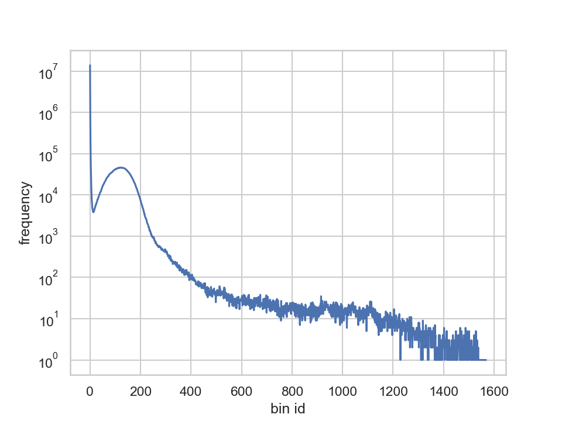
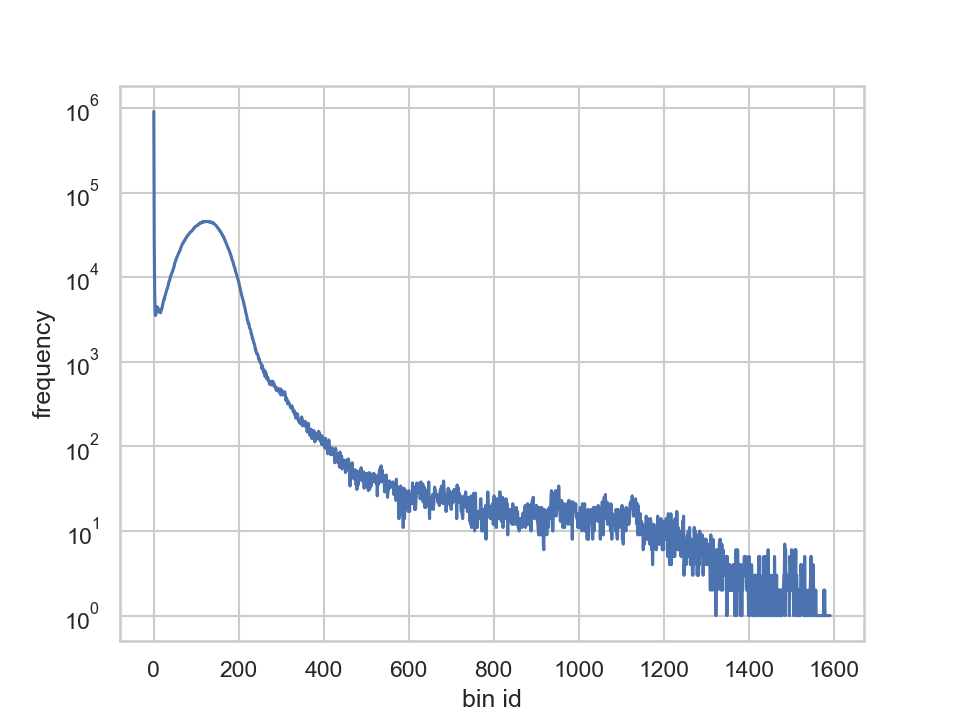

## 1. Exploring the dataset

Time:  
`fastqc -o . SRR292678sub_S1_L001_R1_001.fastq.gz SRR292770_S1_L001_R1_001.fastq.gz SRR292862_S2_L001_R1_001.fastq.gz SRR292678sub_S1_L001_R2_001.fastq.gz SRR292770_S1_L001_R2_001.fastq.gz SRR292862_S2_L001_R2_001.fastq.gz`

Command:  
`Mon Dec 16 14:52:12 MSK 2019`

Output:
```
Started analysis of SRR292678sub_S1_L001_R1_001.fastq.gz
Approx 5% complete for SRR292678sub_S1_L001_R1_001.fastq.gz
Approx 10% complete for SRR292678sub_S1_L001_R1_001.fastq.gz
Approx 15% complete for SRR292678sub_S1_L001_R1_001.fastq.gz
Approx 20% complete for SRR292678sub_S1_L001_R1_001.fastq.gz
Approx 25% complete for SRR292678sub_S1_L001_R1_001.fastq.gz
Approx 30% complete for SRR292678sub_S1_L001_R1_001.fastq.gz
Approx 35% complete for SRR292678sub_S1_L001_R1_001.fastq.gz
Approx 40% complete for SRR292678sub_S1_L001_R1_001.fastq.gz
Approx 45% complete for SRR292678sub_S1_L001_R1_001.fastq.gz
Approx 50% complete for SRR292678sub_S1_L001_R1_001.fastq.gz
Approx 55% complete for SRR292678sub_S1_L001_R1_001.fastq.gz
Approx 60% complete for SRR292678sub_S1_L001_R1_001.fastq.gz
Approx 65% complete for SRR292678sub_S1_L001_R1_001.fastq.gz
Approx 70% complete for SRR292678sub_S1_L001_R1_001.fastq.gz
Approx 75% complete for SRR292678sub_S1_L001_R1_001.fastq.gz
Approx 80% complete for SRR292678sub_S1_L001_R1_001.fastq.gz
Approx 85% complete for SRR292678sub_S1_L001_R1_001.fastq.gz
Approx 90% complete for SRR292678sub_S1_L001_R1_001.fastq.gz
Approx 95% complete for SRR292678sub_S1_L001_R1_001.fastq.gz
Analysis complete for SRR292678sub_S1_L001_R1_001.fastq.gz
x6 times
```


## 2. (optional, 1 extra credit). K-mer profile and genome size estimation

### Running Jellyfish

Time:  
`Mon Dec 16 15:03:03 MSK 2019`

Command:  
`jellyfish count -m 31 -s 1G -t 8 -C -o 31mer_counts.jf SRR292678sub_S1_L001_R1_001.fastq  SRR292678sub_S1_L001_R2_001.fastq`

Output:
```
```

Time:  
`Mon Dec 16 18:01:18 MSK 2019`

Command:  
`jellyfish histo 31mer_counts.jf > 31mer_hist.txt`

Output:
```
```

### Plotting hist
Source code for this plot drawer is in `src/hist.py`. Resulting distribution:



### Estimating genome size

N = (M*L)/(L-K+1) = (1 * 90) / (90 - 31 + 1) = 1,5
Genome_size = T / N = 5499346 * 90 / 1.5 = 329 960 760

## 3. Assembling E. coli X genome from paired reads

### Assembling

Time:  
`Mon Dec 16 18:38:23 MSK 2019`

Command:  
`SPAdes-3.13.0-Linux/bin/spades.py -o SRR292678sub_assembly -t 16 -m 32 --pe1-1 SRR292678sub_S1_L001_R1_001.fastq --pe1-2 SRR292678sub_S1_L001_R2_001.fastq`

Final lines of output:
```
===== Assembling finished. Used k-mer sizes: 21, 33, 55

 * Corrected reads are in /scratch/azabelkin/miniprojects/project3/SRR292678sub_assebly/corrected/
 * Assembled contigs are in /scratch/azabelkin/miniprojects/project3/SRR292678sub_assebly/contigs.fasta
 * Assembled scaffolds are in /scratch/azabelkin/miniprojects/project3/SRR292678sub_assebly/scaffolds.fasta
 * Assembly graph is in /scratch/azabelkin/miniprojects/project3/SRR292678sub_assebly/assembly_graph.fastg
 * Assembly graph in GFA format is in /scratch/azabelkin/miniprojects/project3/SRR292678sub_assebly/assembly_graph_with_scaffolds.gfa
 * Paths in the assembly graph corresponding to the contigs are in /scratch/azabelkin/miniprojects/project3/SRR292678sub_assebly/contigs.paths
 * Paths in the assembly graph corresponding to the scaffolds are in /scratch/azabelkin/miniprojects/project3/SRR292678sub_assebly/scaffolds.paths

======= SPAdes pipeline finished.

SPAdes log can be found here: /scratch/azabelkin/miniprojects/project3/SRR292678sub_assebly/spades.log

Thank you for using SPAdes!
```


### Assesing

Report are generated in online version and saved as `quast_report.html` im corresponding assembly folder.


## 3a (Optional, 1 extra credit). Effect of read correction.

Time:  
`Mon Dec 16 20:40:20 MSK 2019`

Command:  
`jellyfish count -m 31 -s 4G -t 8 -C -o 31mer_counts_corrected.jf SRR292678sub_assembly/corrected/SRR292678sub_S1_L001_R1_001.00.0_0.cor.fastq SRR292678sub_assembly/corrected/SRR292678sub_S1_L001_R2_001.00.0_0.cor.fastq`

Output:
```

```


Time:  
`Mon Dec 16 20:40:20 MSK 2019`

Command:  
`jellyfish count -m 31 -s 4G -t 8 -C -o 31mer_counts_corrected.jf SRR292678sub_assembly/corrected/SRR292678sub_S1_L001_R1_001.00.0_0.cor.fastq SRR292678sub_assembly/corrected/SRR292678sub_S1_L001_R2_001.00.0_0.cor.fastq`

Output:
```

```

Time:  
`Mon Dec 16 20:52:18 MSK 2019`

Command:  
`jellyfish histo 31mer_counts_corrected.jf > 31mer_hist_corrected.txt`

Output:
```

```


Final distribution:




## 4. Impact of reads with large insert size

Time:  
`Mon Dec 16 20:38:58 MSK 2019`

Command:  
`SPAdes-3.13.0-Linux/bin/spades.py -o 3_libs_assembly -t 16 -m 32 --pe1-1 SRR292678sub_S1_L001_R1_001.fastq --pe1-2 SRR292678sub_S1_L001_R2_001.fastq --mp1-1 SRR292770_S1_L001_R1_001.fastq --mp1-2 SRR292770_S1_L001_R2_001.fastq --mp2-1 SRR292862_S2_L001_R1_001.fastq --mp2-2 SRR292862_S2_L001_R2_001.fastq`

Last lines of output:
```
===== Assembling finished. Used k-mer sizes: 21, 33, 55

 * Corrected reads are in /scratch/azabelkin/miniprojects/project3/3_libs_assembly/corrected/
 * Assembled contigs are in /scratch/azabelkin/miniprojects/project3/3_libs_assembly/contigs.fasta
 * Assembled scaffolds are in /scratch/azabelkin/miniprojects/project3/3_libs_assembly/scaffolds.fasta
 * Assembly graph is in /scratch/azabelkin/miniprojects/project3/3_libs_assembly/assembly_graph.fastg
 * Assembly graph in GFA format is in /scratch/azabelkin/miniprojects/project3/3_libs_assembly/assembly_graph_with_scaffolds.gfa
 * Paths in the assembly graph corresponding to the contigs are in /scratch/azabelkin/miniprojects/project3/3_libs_assembly/contigs.paths
 * Paths in the assembly graph corresponding to the scaffolds are in /scratch/azabelkin/miniprojects/project3/3_libs_assembly/scaffolds.paths

======= SPAdes pipeline finished.

SPAdes log can be found here: /scratch/azabelkin/miniprojects/project3/3_libs_assembly/spades.log

Thank you for using SPAdes!
```

## 5. Genome Annotation

Time:  
`Mon Dec 16 22:31:22 MSK 2019`

Command:  
`prokka scaffolds.fasta`

Last lines of output:
```
...
[22:35:52] Output files:
[22:35:52] PROKKA_12162019/PROKKA_12162019.gbk
[22:35:52] PROKKA_12162019/PROKKA_12162019.sqn
[22:35:52] PROKKA_12162019/PROKKA_12162019.ffn
[22:35:52] PROKKA_12162019/PROKKA_12162019.log
[22:35:52] PROKKA_12162019/PROKKA_12162019.fsa
[22:35:52] PROKKA_12162019/PROKKA_12162019.err
[22:35:52] PROKKA_12162019/PROKKA_12162019.txt
[22:35:52] PROKKA_12162019/PROKKA_12162019.tbl
[22:35:52] PROKKA_12162019/PROKKA_12162019.tsv
[22:35:52] PROKKA_12162019/PROKKA_12162019.faa
[22:35:52] PROKKA_12162019/PROKKA_12162019.gff
[22:35:52] PROKKA_12162019/PROKKA_12162019.fna
[22:35:52] Annotation finished successfully.
[22:35:52] Walltime used: 5.22 minutes
[22:35:52] If you use this result please cite the Prokka paper:
[22:35:52] Seemann T (2014) Prokka: rapid prokaryotic genome annotation. Bioinformatics. 30(14):2068-9.
[22:35:52] Type 'prokka --citation' for more details.
[22:35:52] Share and enjoy!
```

## 6. Finding the closest relative of E. coli X

### Locating 16S rRNA

Time:  
`Mon Dec 16 22:38:22 MSK 2019`

Command:  
`barrnap --threads 8 -o scaffolds_rrna.fa scaffolds.fasta`

Last lines of output:
```
...
[barrnap] Found 19 ribosomal RNA features.
[barrnap] Sorting features and outputting GFF3...
[barrnap] Done.
##gff-version 3
NODE_1_length_1911855_cov_74.241476	barrnap:0.9	rRNA	790305	790406	4.9e-10	-	.	Name=5S_rRNA;product=5S ribosomal RNA
NODE_1_length_1911855_cov_74.241476	barrnap:0.9	rRNA	790579	793483	0	-	.	Name=23S_rRNA;product=23S ribosomal RNA
NODE_1_length_1911855_cov_74.241476	barrnap:0.9	rRNA	793841	795378	0	-	.	Name=16S_rRNA;product=16S ribosomal RNA
NODE_1_length_1911855_cov_74.241476	barrnap:0.9	rRNA	831886	831987	4.9e-10	-	.	Name=5S_rRNA;product=5S ribosomal RNA
NODE_1_length_1911855_cov_74.241476	barrnap:0.9	rRNA	832160	835060	0	-	.	Name=23S_rRNA;product=23S ribosomal RNA
NODE_1_length_1911855_cov_74.241476	barrnap:0.9	rRNA	835418	836955	0	-	.	Name=16S_rRNA;product=16S ribosomal RNA
NODE_1_length_1911855_cov_74.241476	barrnap:0.9	rRNA	1410869	1412406	0	-	.	Name=16S_rRNA;product=16S ribosomal RNA
NODE_285_length_223_cov_0.720238	barrnap:0.9	rRNA	19	129	5.6e-18	+	.	Name=5S_rRNA;product=5S ribosomal RNA
NODE_2_length_1048041_cov_73.759880	barrnap:0.9	rRNA	641223	641333	2.2e-11	-	.	Name=5S_rRNA;product=5S ribosomal RNA
NODE_2_length_1048041_cov_73.759880	barrnap:0.9	rRNA	641432	644189	0	-	.	Name=23S_rRNA;product=23S ribosomal RNA
NODE_2_length_1048041_cov_73.759880	barrnap:0.9	rRNA	644690	646227	0	-	.	Name=16S_rRNA;product=16S ribosomal RNA
NODE_3_length_740956_cov_75.729124	barrnap:0.9	rRNA	353680	355217	0	+	.	Name=16S_rRNA;product=16S ribosomal RNA
NODE_3_length_740956_cov_75.729124	barrnap:0.9	rRNA	355718	358475	0	+	.	Name=23S_rRNA;product=23S ribosomal RNA
NODE_3_length_740956_cov_75.729124	barrnap:0.9	rRNA	358574	358684	2.2e-11	+	.	Name=5S_rRNA;product=5S ribosomal RNA
NODE_5_length_307206_cov_78.387034	barrnap:0.9	rRNA	84700	84801	4.9e-10	-	.	Name=5S_rRNA;product=5S ribosomal RNA
NODE_5_length_307206_cov_78.387034	barrnap:0.9	rRNA	84974	87874	0	-	.	Name=23S_rRNA;product=23S ribosomal RNA
NODE_5_length_307206_cov_78.387034	barrnap:0.9	rRNA	88324	89861	0	-	.	Name=16S_rRNA;product=16S ribosomal RNA
NODE_5_length_307206_cov_78.387034	barrnap:0.9	rRNA	185633	187170	0	-	.	Name=16S_rRNA;product=16S ribosomal RNA
NODE_87_length_720_cov_1.094737	barrnap:0.9	rRNA	314	719	9.9e-23	+	.	Name=16S_rRNA;product=16S ribosomal RNA (partial);note=aligned only 25 percent of the 16S ribosomal RNA

```


Time:  
``

Command:  
``

Output:
```

```